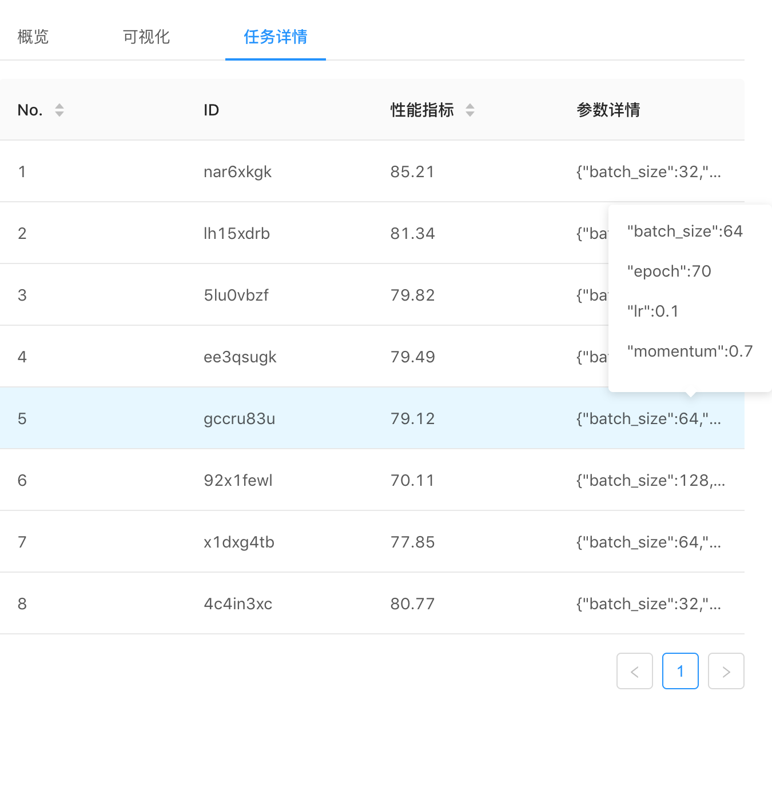

# Workspace

### 工作区约定

每个用户可以任意创建工作区资源。可在“工作区”页面创建和浏览

### 新建工作区

支持工作区资源的创建，将git代码仓库、数据卷抽象为工作区资源，帮助用户管理机器学习代码与数据集

1. 进入工作区界面，点击添加

   

2. 填写工作区名、git仓库地址、数据集、深度学习框架、woker数目、GPU数目等信息

3. 创建后页面显示工作区基本情况。创建成功后Status为“就绪”

### 单次训练任务的创建

在进入工作区后，直接点击右上角"运行"按钮，即可添加一次训练任务

### 自动化调参

通过自定义超参数取样空间、寻参算法等，帮助用户得到最优超参数，免去重复工作的烦恼；同时提供可视化界面展示，可查看训练进度、Loss变化等数据

1. 在进入工作区后，直接点击右上角"增加调参任务"按钮，弹出自动化调参任务的数据录入

   

2. 输入搜索算法、数据集、运行空间、超参数取样空间等信息后，提交

   

3. 点击调参任务的详情，即可查看调参任务的进度以及其他信息

   

   

   

### Vscode环境

提供Vscode在线开发环境，使开发者灵活Coding

点击工作区的vscode按钮，即可进入对应的vscode开发环境

进入vscode在线环境

### 任务日志查询

对于该工作区的单次训练任务，提供log日志查询功能

1. 进入某个工作区

2. 任务列表展示的训练任务中，点击查看记录按钮，弹出日志

   

   

### 工作区的销毁

对于不再使用的工作区资源，可直接销毁，释放资源

直接在需要删除的工作区右侧的“更多”按钮，点击删除，即可释放相应资源

